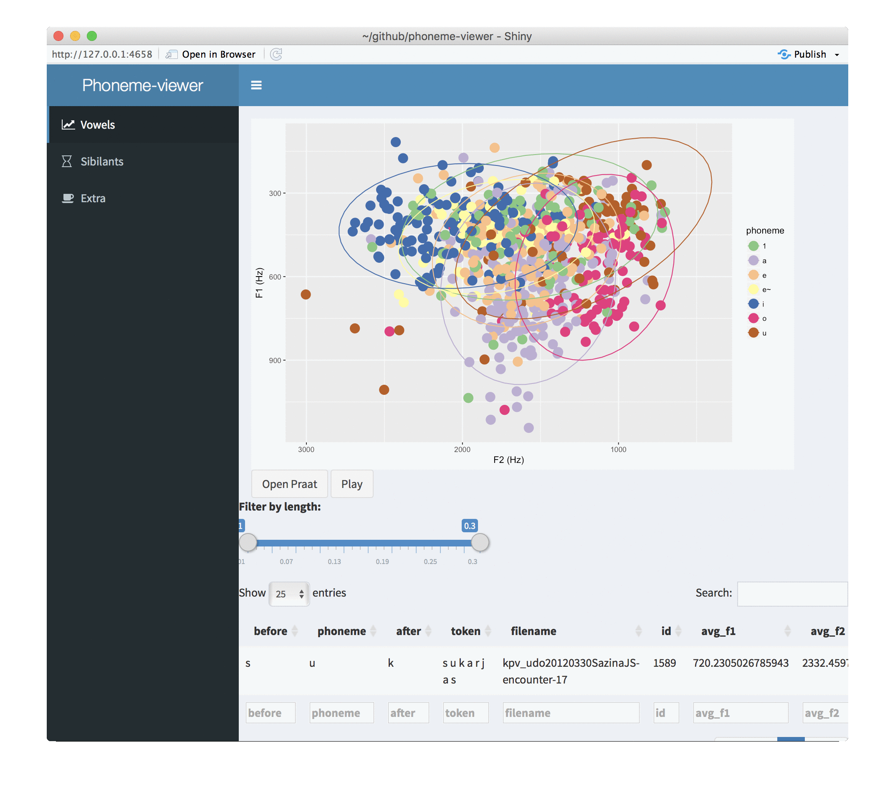

## Phoneme Viewer app

This is a simple application that demonstrates possibilities of viewing and exploring information extracted from Praat TextGrids. As the application is able to open files in Praat, it is easy to iterate through the values that look suspicious, which often indicates they are not aligned correctly.

The whole idea is that PraatScript that extracts the information is run in Shell script which could also be tied into a system call, and this way we can generate them again immediately after editing TextGrid. The application is based on the idea that we can open TextGrid through something like this:

```
open_praat <- function(filename, start, end, praat_executable = '/Applications/Praat.app/Contents/MacOS/Praat'){
  system(glue('open -a {praat_executable}'))
  system(glue('~/bin/sendpraat_carbon praat "execute {praat_stuff_folder}/open_segment.praat {textgrids_and_wavs}/{filename}.wav {textgrids_and_wavs}/{filename}.TextGrid {start} {end}"'))
}
```

And then `open_segment.praat` contains this:

```
form Info
     word textgrid_file chain
     word sound chain
     positive start
     positive end
endform

sound = Read from file: sound$
textgrid = Read from file: textgrid_file$

plusObject: sound

View & Edit

```

And this can then be combined into button in Shiny application or where ever. Of course it will not work as a web application in that sense, but it allows quite fast interactive work.

Idea is that you:

- Select something in a plot (click and brush are both implementable)
- It appears in the data table below the plot
- Praat button does what was described above

Problems:

- For some reason listening button doesn't work
- Centre of gravity part doesn't work for Praat, it would be easy to fix though



In principle it should be runnable with:

```
shiny::runGitHub("langdoc/phoneme-viewer")
```

But I have no idea whether it works on anyone elses computer. In principle the sendpraat stuff should be pretty standard.